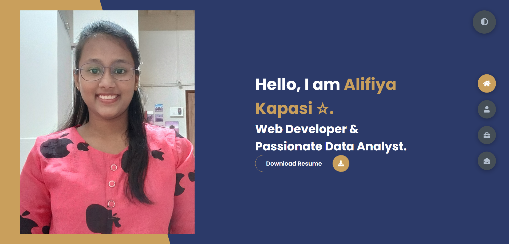
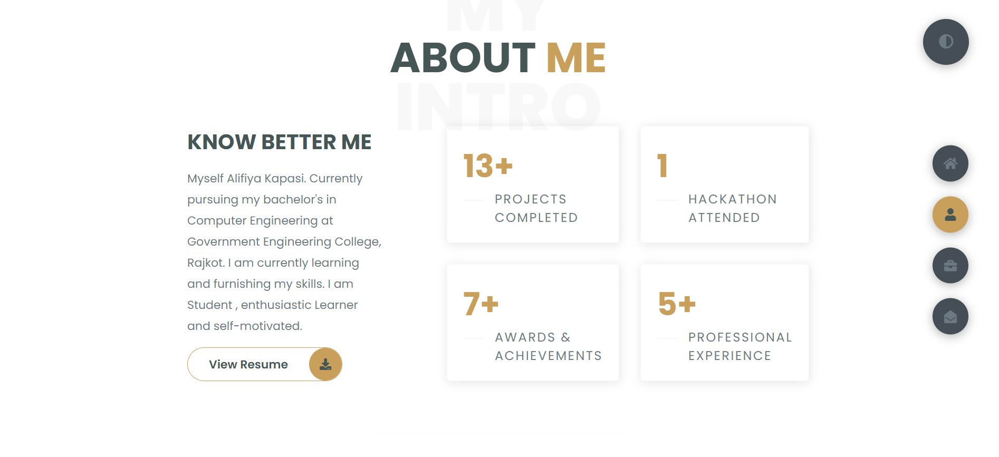
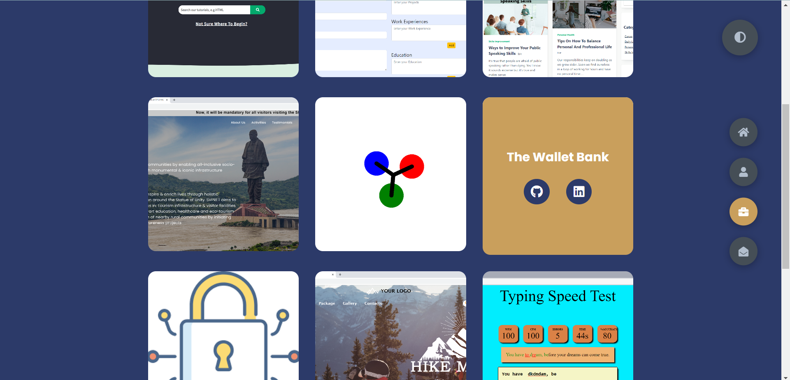

# Portfolio_Alifiya🔥
> https://alifiyakapasi07.github.io/Portfolio_Alifiya/

## Website Preview
#### Home Page

#### Light theme Background skils section

#### Projects Work

  

## Features 📋
⚡️ Fully Responsive
⚡️ Easy to modify
⚡️ Dark Mode

## Sections 📚
✔️ Home Page\
✔️ About Me\
✔️ Skills \
✔️ Education\
✔️ Experience\
✔️ Projects \
✔️ Resume\
✔️ Contact Me

## Tools Used 🛠️
* <b>GitHub Pages</b> - To host my static website (HTML, CSS, JS).
